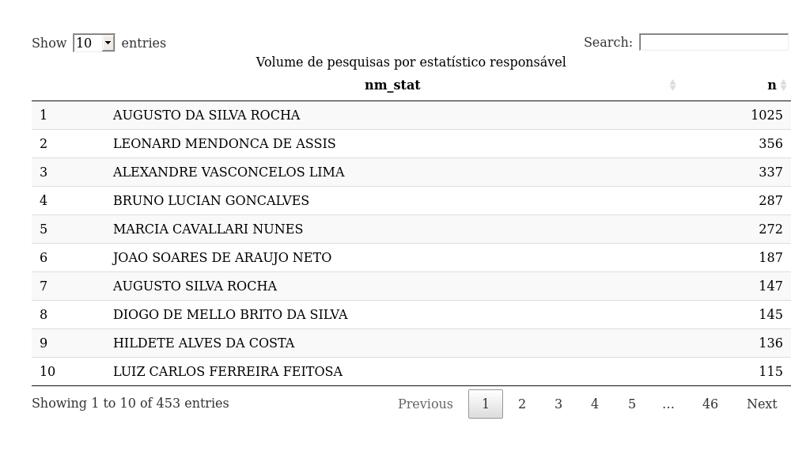
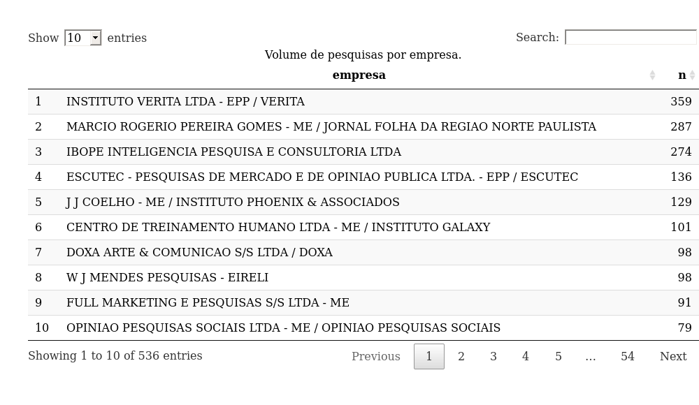
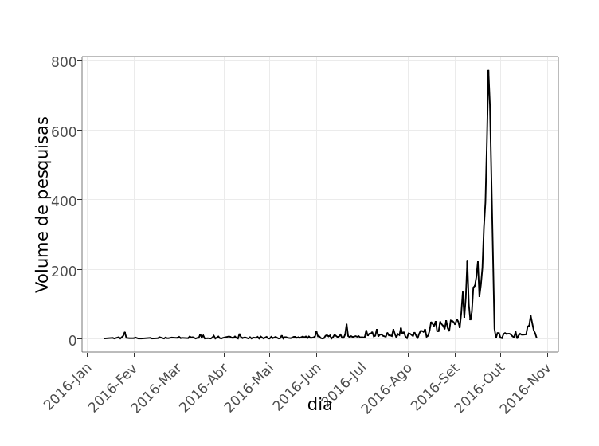
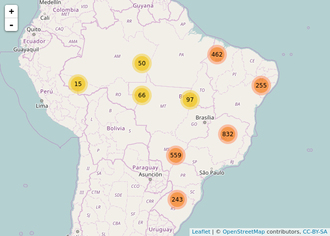
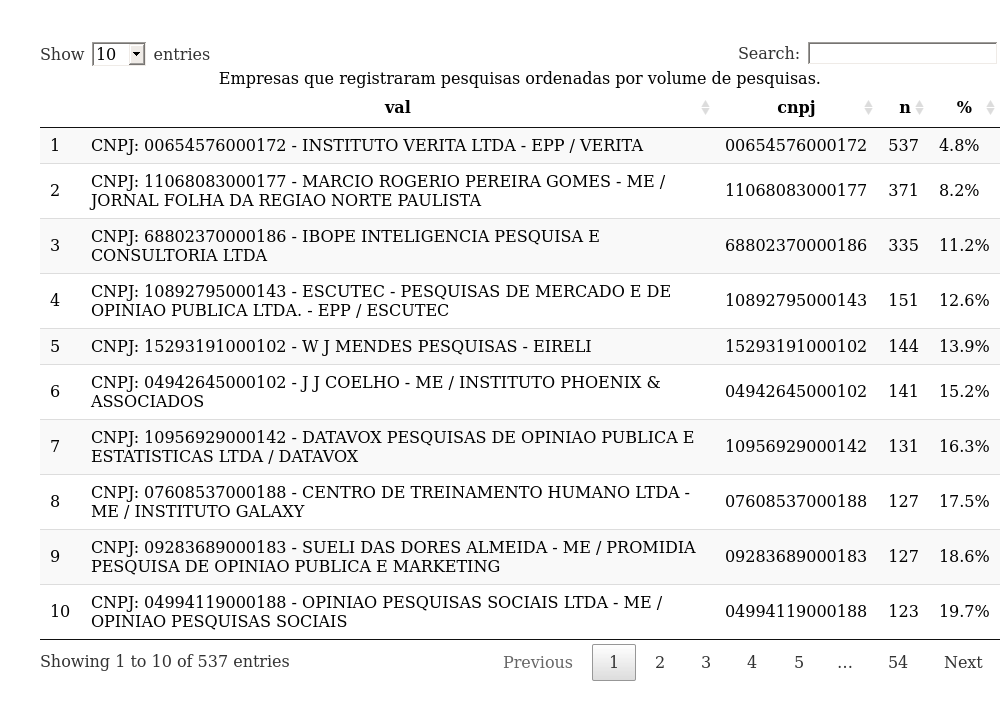
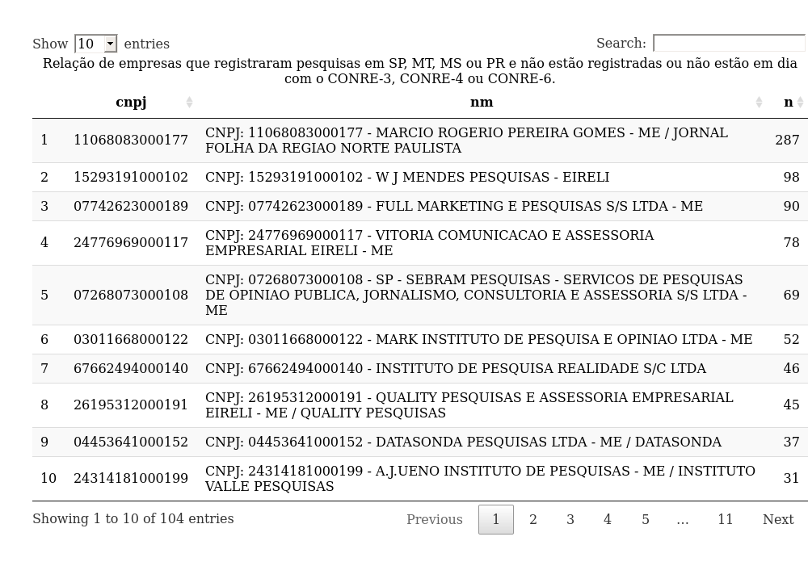

pesqEle
=======

Scraper de estatísticos registrados nas pesquisas do TSE.

Instalação
----------

Este pacote não está disponível no CRAN. Para instalar, rode

    if (!require(devtools)) install.packages('devtools')
    devtools::install_github('conre3/pesqEle')

Utilização
----------

Esse pacote contém funções úteis para baixar informações do serviço
[pesqEle](http://inter01.tse.jus.br/pesqele-publico/app/pesquisa/listarEstatisticos.xhtml)
do TSE. Exemplo de utilização:

    library(pesqEle)
    data(cities)
    d_log <- pesq_download_cities(head(cities))
    arqs_main <- dir('data-raw/html', 
                     pattern = '[A-Z]{2}_[0-9]+\\.html',
                     full.names = TRUE)
    arqs_details <- dir('data-raw/html', 
                        pattern = '[A-Z]{2}_[0-9]+_[0-9]+\\.html',
                        full.names = TRUE)
    d_main <- pesq_parse_main(arqs_main)
    d_details <- pesq_parse_main(arqs_details)

As bases completas já foram baixadas e carregadas no pacote:

-   `cities` contém a relação de cidades.
-   `pesq_main` contém informações básicas de cada pesquisa eleitoral.
-   `pesq_detalhes` contém detalhes de cada pesquisa eleitoral.

Veja `help(<bd>)` para mais detalhes.

Histórico
=========

A [Consulta às Pesquisas Eleitorais por
Estatístico](http://inter01.tse.jus.br/pesqele-publico/app/pesquisa/listarEstatisticos.xhtml)
é uma ferramenta do TSE que permite consultar todas as pesquisas
eleitorais realizadas no Brasil. A possibilidade de pesquisar pesquisas
por nome do estatístico revelou uma série de fraudes, como a [inclusão
indevida da presidente do CONRE-3 em mais de 20 pesquisas
eleitorais](http://www.conre3.org.br/portal/3113-2/).

Análise da base de dados
========================

Foram baixadas duas bases principais. A primeira, aqui chamada
`pesq_main` mostra informações básicas de cada pesquisa,
especificamente: código identificador, nome fantasia da empresa
contratada, nome e número de registro do estatístico, data de registro,
município e UF. A segunda, chamada `pesq_details` está estruturada na
forma 'key-value' e contém informações do plano amostral, custo e CNPJ
da empresa responsável.

Base principal
--------------

Temos no total 8104 pesquisas registradas, envolvendo 453 nomes
distintos de estatísticos responsáveis e 536 nomes distintos de
empresas.

As Tabelas @ref(fig:stat20) e @ref(fig:emp20) mostram o volume de
pesquisas registradas por nome do estatístico responsável e nome
fantasia da empresa, respectivamente.

A Figura @ref(fig:tempo) mostra o volume de pesquisas registradas
diariamente.

A Figura @ref(fig:map) mostra a distribuição geográfica das pesquisas.
Ainda falta arrumar 19 nomes que não bateram.

Base detalhada
--------------

A Tabela @ref(fig:cnpj) mostra todas as 537 empresas que registraram
pesquisas, ordenadas por volume de pesquisas. As 10 empresas com maior
volume de pesquisas concentram 20% das pesquisas.

A Tabela @ref(tab:conre) confronta os CNPJs das empresas que realizaram
pesquisas (somente em SP, PR, MT e MS) com a relação de empresas que
estão registradas e em dia com o CONRE-3, o CONRE-4 ou o CONRE-6. A
Tabela @ref(fig:conre2) mostra a relação das empresas que não estão
registradas ou estão registradas e não estão em dia com o CONRE-3 ou
CONRE-6. É importante mencionar que as empresas dessa relação podem ser
registradas em conselhos de outras regiões.

<table>
<caption>Contagem de empresas registradas no CONRE-3, CONRE-4 ou CONRE-6 que registraram pesquisas no TSE (somente em SP, PR, MT e MS).</caption>
<thead>
<tr class="header">
<th align="left">Registrado</th>
<th align="right">n</th>
</tr>
</thead>
<tbody>
<tr class="odd">
<td align="left">Não</td>
<td align="right">104</td>
</tr>
<tr class="even">
<td align="left">Sim</td>
<td align="right">66</td>
</tr>
</tbody>
</table>

License
=======

MIT
